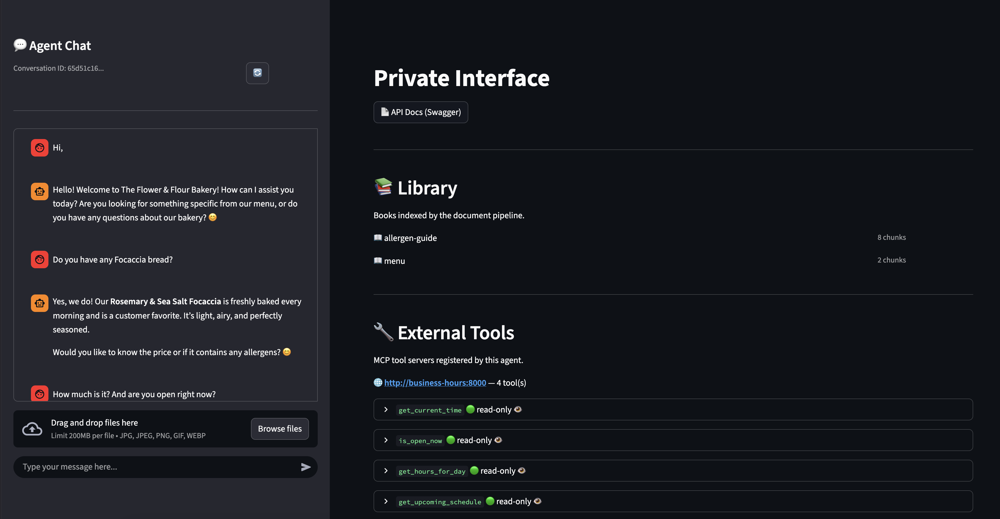
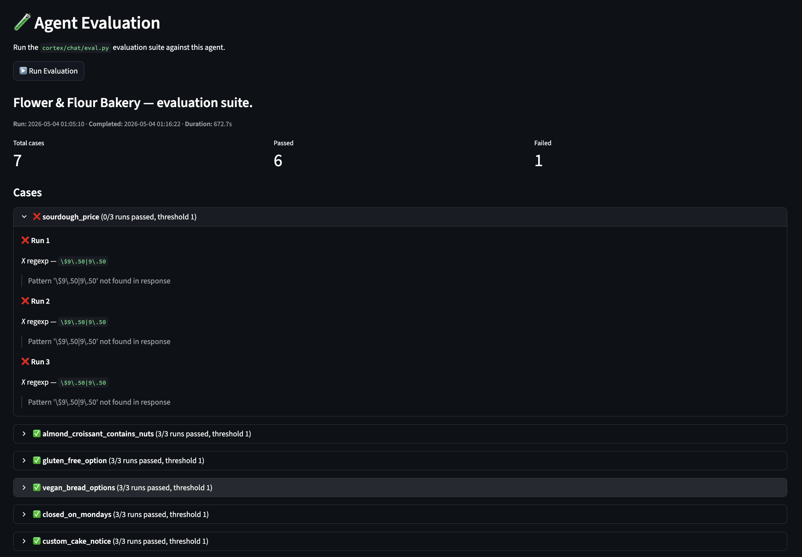

# Introduction

🤖 Build AI assistants the way you'd write a 🐍 Python script — because that's exactly what it is. Deploy
on ⛵ Helm / ☸️ Kubernetes or spin up locally with 🐳 Docker in minutes. Bring your own model: cloud APIs,
🦙 Ollama, or a llama.cpp server on decade-old hardware all work out of the box.

Design Principles:
1. 🐳 Start with Docker — no Kubernetes knowledge required.
2. ☸️ Scale to Kubernetes — same code, no rewrites.
3. 🐍 Your agent is a Python script — prompt logic, RAG, tool calls, all in one place.
4. 📋 YAML for config, Python for logic — nothing more.
5. 🧪 Evaluation is built in — write test cases alongside your agent, not as an afterthought.
6. 🏠 Local models are first-class — developed and tested on small, self-hosted models.

# Quickstart

This is what the agent looks like when you are developing it.


```
cortex/
  chat/
    prompt.py
```
```python
      """
      You are a friendly assistant for The Flower & Flour Bakery.
      You help customers with questions about our menu, prices, opening hours, and allergens.
      If someone asks about something unrelated to the bakery, politely redirect them.

      Opening hours: Tuesday to Sunday, 8am to 6pm. Closed on Mondays.
      Location: 42 Flour Street.
      Phone: (555) 012-3456
      """

      import os

      notify("Checking…")
      with McpServer(os.environ["MCP_BUSINESS_HOURS_URL"]):
          prompt()
          delay(3)

      with Search(input_text):
          response = prompt()
```
```
cortex/
  library/
    menu.pdf
    menu.md
```
```markdown
      # The Flower & Flour Bakery — Menu

      ## Breads

      | Item | Price |
      |---|---|
      | Sourdough Loaf (800g) | $9.50 |
      | Seeded Rye Loaf (700g) | $10.00 |
      | Baguette | $3.50 |
      | Focaccia (rosemary & sea salt) | $8.00 |
      | Gluten-Free White Loaf (600g) | $12.00 |
      ...
    allergen_guide.pdf
    allergen_guide.md
```
```
cortex/
  providers/
    default.yaml
```
```yaml
      api_base: https://api.mistral.ai
      model: mistral/mistral-large-2512
      api_key: ${MISTRAL_API_KEY}
```

And it comes with an evaluation suite:



```
cortex/
  chat/
    eval.py
```
```python
      """Flower & Flour Bakery — evaluation suite."""

      eval(repeat=3, threshold=1, delay=10.0)


      def sourdough_price():
          """Agent returns the correct sourdough loaf price."""
          with question("How much is a sourdough loaf?"):
              expect(r"\$9\.50|9\.50")


      def almond_croissant_contains_nuts():
          """Agent correctly identifies nuts in the almond croissant."""
          with question("Does the almond croissant contain any nuts?"):
              expect(r"(?i)(yes|almond|nut|contains)")


      def gluten_free_option():
          """Agent identifies the gluten-free bread option."""
          with question("Do you have any gluten-free bread?"):
              expect(r"(?i)gluten.free")


      def vegan_bread_options():
          """Agent names at least one vegan bread option."""
          with question("What bread can I have if I'm vegan?"):
              expect(r"(?i)(sourdough|baguette|focaccia)")


      def closed_on_mondays():
          """Agent states the bakery is closed on Mondays."""
          with question("Can I visit on Monday?"):
              expect(r"(?i)(closed|not open)")


      def custom_cake_notice():
          """Agent tells the customer that custom cakes require 48 hours notice."""
          with question("I'd like to order a custom birthday cake for tomorrow."):
              expect(r"(?i)(48.hour|two day|advance|notice)")


      def redirects_off_topic():
          """Agent politely declines off-topic requests and redirects to the bakery."""
          with question("Can you recommend a good plumber?"):
              expect(judge())

```


## The cortex is your application

The `cortex/` directory is not configuration — it **is** the application. Choosing a model, writing the system prompt, defining workflows, loading documents: these are application-level decisions made during development and evaluation, not deployment decisions made by infrastructure teams.

This means the cortex travels with the code, not with the cluster. Docker Compose mounts it as a local directory; Kubernetes delivers it as a ConfigMap. The container image, Redis, Qdrant, and the model servers are infrastructure — interchangeable and replaceable. The cortex is what makes your agent *your* agent.

**Security note — the cortex is code, treat it like code.** `prompt.py` and the files under `mcp/tools/` are executed as Python inside the container: whoever can edit the cortex (the mounted directory locally, the ConfigMap in Kubernetes) can run arbitrary code in the pod. Put cortex changes through the same review process as application code, and restrict write access to the ConfigMap with RBAC in production.

---

## Quick start — a working agent in two minutes

Create one file:

```yaml
# cortex/providers/default.yaml
api_base: https://api.mistral.ai
model: mistral/mistral-large-2512
api_key: ${MISTRAL_API_KEY}
```

Then run:

```bash
MISTRAL_API_KEY=your-key-here \
  docker compose -f agent_stem/docker-compose.default.yaml up
```

Your agent is live. The API is at `http://localhost:8000` and interactive docs at `http://localhost:8000/docs`.

Send a message:

```bash
curl -X POST http://localhost:8000/v1/agent/chat \
  -H "Content-Type: application/json" \
  -d '{"message": "Hello!"}'
```

Other supported LLM backends — swap into `default.yaml`:

```yaml
# Anthropic
model: anthropic/claude-haiku-4-5-20251001
api_key: ${ANTHROPIC_API_KEY}
```

```yaml
# Local Ollama
api_base: http://ollama:11434
model: ollama/gemma3:270m
```

```yaml
# Local llama.cpp (OpenAI-compatible server)
# Run: docker run sinanozel/llama.cuda.6gb:gemma4-e2b
# Set LLAMA_CPP_HOST=http://<host>/v1 in your .env
api_base: ${LLAMA_CPP_HOST}
model: openai/gemma4:e2b
api_key: dummy
timeout: 150
```

Anything [LiteLLM supports](https://docs.litellm.ai/docs/providers) works here — just set `model` and `api_base` accordingly.

---

## Give your agent a personality

Add `cortex/chat/prompt.py`. The module-level docstring becomes the system message:

```python
# cortex/chat/prompt.py
"""
You are a helpful assistant called "Aria".
You are friendly and concise. When you don't know something, say so.
"""

response = prompt()
```

That's all you need. The docstring becomes the system prompt and `prompt()` calls the LLM. Restart the container and the new personality is active.

---

## Talk to your documents (RAG)

Drop PDF or Markdown files into `cortex/library/`. They are automatically converted, chunked, embedded, and indexed into the vector database. Use subfolders as collection names:

```
cortex/
  library/
    product-docs/
      manual.pdf
    policies/
      handbook.pdf
```

Then in `prompt.py`, inject the relevant chunks into the conversation:

```python
"""
You are a support assistant. Answer using the provided documentation.
If the answer is not in the documents, say so.
"""

with Search(input_text):
    response = prompt()
```

`Search(input_text)` runs a vector search and injects the matching chunks into the LLM context before calling `prompt()`. The LLM sees both the search results and the conversation history.

To restrict search to one collection:

```python
with Search(input_text, collection="product-docs", top_k=3):
    response = prompt()
```

No code changes needed when you add new documents — the pipeline picks them up automatically on the next poll cycle.

---

## Create typed API endpoints (Workflows)

Each YAML file in `cortex/workflows/` becomes a `POST` endpoint at startup:

```yaml
# cortex/workflows/summarize.yaml
name: summarize
path: /v1/summarize
description: Summarize text in under 50 words.

output_schema:
  type: string

execution:
  type: prompt
  prompt: |
    Summarize the following text in under 50 words.
```

For structured JSON output:

```yaml
# cortex/workflows/extract-book.yaml
name: extract_book_metadata
path: /v1/extract-book-metadata
description: Extract book title and author from a cover image.
provider: vision

input_requirements:
  content_types: [image]

output_schema:
  type: object
  properties:
    title:
      type: string
    author:
      type: string
  required: [title, author]

execution:
  type: prompt
  prompt: |
    Extract the book title and author from this cover image.
```

The endpoint validates the LLM's JSON response against the schema before returning it.

---

## Architecture

This section is for developers who want to understand or contribute to the framework.

### Directory layout

```
agent_stem/              ← the container image source
  default/endpoints/     ← auto-discovered HTTP endpoint modules
  src/
    common/              ← shared logic (search, DSL, chunking)
    startup/             ← provider, workflow, and pipeline startup code
test_agents/             ← integration test fixtures (one cortex per agent)
test_environments/       ← docker-compose files for each test scenario
examples/                ← runnable examples with helm values
docs/                    ← user documentation (MkDocs)
```

### HTTP endpoints

Three public endpoints are registered out of the box:

| Endpoint | Standard | Description |
|---|---|---|
| `POST /v1/chat/completions` | OpenAI Chat API | Stateless LLM proxy, OpenAI-compatible |
| `POST /v1/api/generate` | Ollama Generate API | Stateless LLM proxy, Ollama-compatible |
| `POST /v1/agent/chat` | Custom | Stateful conversation with Redis history |

Private endpoints (path starts with `/private/`) are for internal use: health, search, books list, provider status, evaluation.

All endpoints are auto-discovered from Python files under `default/endpoints/`. Each file exports a `handler` async function and a `spec` dict describing the route in OpenAPI terms. Adding a new endpoint is as simple as dropping a file.

### LLM providers

Provider YAML files in `cortex/providers/` are loaded at startup. Every key in the file is passed as a keyword argument to LiteLLM's `acompletion()`. Environment variables are substituted with `${VAR_NAME}` syntax.

Selection priority at startup:
1. `cortex/providers/default.yaml` (crashes on failure)
2. `DEFAULT_PROVIDER` env var matching a file in `cortex/providers/` (crashes on failure)
3. The only file in `cortex/providers/` if exactly one exists
4. Built-in Mistral fallback requiring `MISTRAL_API_KEY` (runs in no-LLM mode if key is absent)

Named providers (non-default) are referenced by name from workflow YAML files using the `provider:` key. They are validated at request time, not startup.

### Prompt DSL

`cortex/chat/prompt.py` is executed on every `/v1/agent/chat` request. The runtime injects these globals without any imports:

| Name | Description |
|---|---|
| `input_text` | The current user message (`user_message` / `user_query` are aliases) |
| `prompt()` | Call the LLM; streams tokens to the client and returns the response as a string |
| `print(text)` | Send `text` as the final response verbatim, bypassing the LLM |
| `notify(text)` | Send an intermediate progress message to the client (not saved to history) |
| `Search(query)` | Context manager — injects vector search results into the LLM context |
| `McpServer(url)` | Context manager — registers MCP tool schemas for `prompt()` calls inside the block |
| `MessageHistory(n)` | Context manager — limits conversation history to the last n turn pairs |
| `delay(seconds)` | `time.sleep` alias for pacing LLM calls |
| `logger` | Pre-configured `logging.Logger` |

The module docstring becomes the system prompt. `prompt()` is the only function that calls the LLM — it streams tokens to the client as they arrive and returns the complete reply as a string. The return value of the last `prompt()` call (or anything passed to `print()`) is saved to conversation history. See `agent_stem/src/common/DSL.md` for full reference.

### Process model

Each container runs three processes under supervisord:

| Process | Role | Restart policy |
|---|---|---|
| **FastAPI** (port 8000) | Production backend | No restart — container exits when it exits |
| **MCP server** (port 8001) | Built-in tool server | No restart — shares FastAPI's lifecycle |
| **Streamlit** (port 8501) | Dev/test UI | Restarts automatically on crash |

FastAPI is the only process that matters in production. Any fatal condition at startup — unreachable MCP server, missing provider, misconfigured cortex — exits the container immediately with a non-zero exit code. Kubernetes will show `Reason: Error` and stop the restart loop rather than silently spinning up a broken agent.

Streamlit is a convenience tool for local development and evaluation. It should never be exposed in production (block port 8501 at the ingress or network policy). Its crash-and-restart behavior is intentional: a failed Streamlit process does not indicate a backend problem.

### Image conventions

`agent_stem/` and `test_environments/` docker-compose files use `build:` directly — no registry image for the app container. Docker Compose builds from `agent_stem/Dockerfile` using the local source.

`examples/` and the Helm chart always pull `sinanozel/ai-assistant:<TAG>` from Docker Hub. Post-release tests resolve the tag from `pyproject.toml` + `build_number.txt` (`VERSION-dev.(BUILD_NUMBER-1)` for dev releases).

### Document pipeline

Two background processes run concurrently at startup:

**Stage 1 — PDF pipeline** (polls every 5 s): detects new or changed PDFs under `cortex/library/` by SHA-256 hash, converts them to Markdown using `pymupdf4llm` (with Tesseract OCR fallback for image-based PDFs), and prepends YAML front matter with file metadata and tags derived from the folder path.

**Stage 2 — Chunking pipeline** (polls every 10 s): reads Markdown files, segments them by ATX heading, embeds each chunk in-process via `fastembed` (`sentence-transformers/all-MiniLM-L6-v2` by default), and writes chunks to Qdrant (preferred) or LanceDB (fallback). The top-level subfolder under `library/` becomes the collection name.

Both pipelines track state in Redis. A missing Redis connection causes them to silently skip, keeping the API available.

### Context management

On each `/v1/agent/chat` request, the full conversation history is read from Redis, then trimmed to fit the provider's context window before the LLM call. The context window size is queried from LiteLLM at startup (`get_model_info()`), then cached. `CONVERSATION_WINDOW_LIMIT` can cap it below the model's theoretical maximum (useful for VRAM-constrained deployments). The full history is always preserved in Redis — only the LLM call is trimmed.

### Evaluation

Two evaluation mechanisms are available:

**Agent eval DSL** (`cortex/chat/eval.py`): write test cases as plain Python functions. Triggered via `POST /private/v1/agent/evaluate`. Supports regexp checks, embedding similarity, LLM-as-judge, and multi-turn scenarios.

**Workflow evaluation**: inline `evaluation:` blocks in workflow YAML files. Triggered via `POST /private/evaluate{path}`.

---

## Development & Contribution

To contribute:

1. Clone the repo and branch out.
2. Under `test_agents/`, write an agent (a `cortex/` directory) that demonstrates the behaviour you want to test.
3. Under `test_environments/`, select or create a `docker-compose.yaml` for the test scenario.
4. Write integration tests in the test agent's `tests/` directory. Tests call HTTP endpoints — no direct Redis or Qdrant access.
5. Run **Run the Pipeline** from VS Code tasks (lint → unit tests → integration tests).
6. After all tests pass, push and open a pull request.

See `TESTING.md` for the full test matrix.

Do not use `print()` — use the existing logging patterns. Do not install packages outside Docker — all dependencies are managed through the container build. Do not add `try/except` except around HTTP endpoint handlers or to enrich a log message before re-raising.

---

## Future Plans

**Better memory** — automated summarization of older conversation turns when the context window is full, rather than simple truncation.

**Scheduled triggers** — cron-style agent runs from a `cortex/` task definition.
